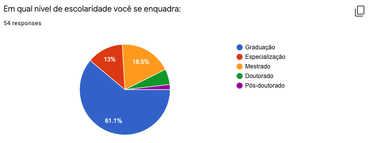

```{r setup, include=FALSE}
knitr::opts_chunk$set(echo = TRUE)
```

```{r pck, echo=FALSE, warning=FALSE, message=FALSE}
# você deve carregar os pacotes nesse code chunk

```

# Assignment {-}

Suponha que você está participando de um processo seletivo no Google para uma vaga de Ciência de Dados.
Nele, você deve realizar a seguinte tarefa:

# Aprimore a visualização gráfica gerada automaticamente pelo google form para cada uma das imagens abaixo:

- use a base de dados de `perfil-alunos.csv`.
- se necessário, aplique o conhecimento adquirido até aqui.
- sua resposta deve estar abaixo de cada imagem e seu código deve ser apresentado

<center>
{width=700px}
</center>

<center>
{width=700px}
</center>

<center>
{width=700px}
</center>

<center>
{width=700px}
</center>

# Apresente abaixo uma sugestão para melhorar a coleta de dados através do formulário:


# Produza um documento .html com o resultado de sua análise

**Observação**: Não se esqueça de colocar seu nome.


