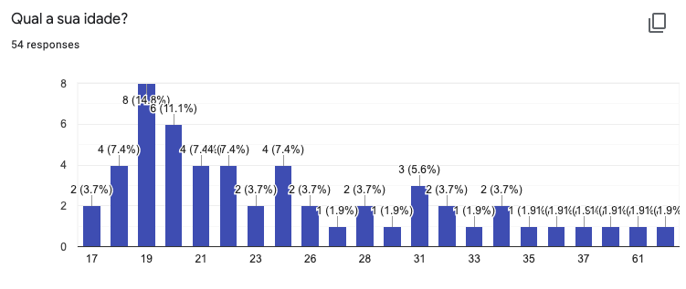
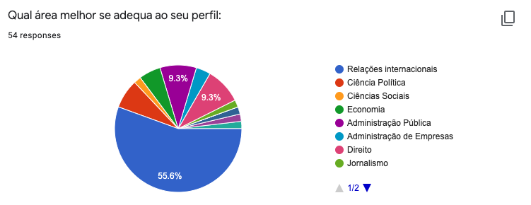
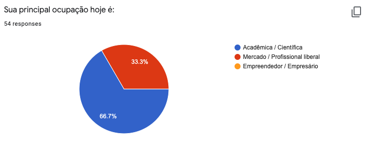

```{r setup, include=FALSE}
knitr::opts_chunk$set(echo = TRUE)
```

```{r pck, echo=FALSE, warning=FALSE, message=FALSE}
# você deve carregar os pacotes nesse code chunk
library(tidyverse)
library(here)
```

# Assignment {-}

Suponha que você está participando de um processo seletivo no Google para uma vaga de Ciência de Dados.
Nele, você deve realizar a seguinte tarefa:

# Aprimore a visualização gráfica gerada automaticamente pelo google form para cada uma das imagens abaixo:

- use a base de dados de `perfil-turma.csv`.
- se necessário, aplique o conhecimento adquirido até aqui.
- sua resposta deve estar abaixo de cada imagem e seu código deve ser apresentado

<center>
{width=700px}
</center>

```{r echo=FALSE, warning=FALSE, message=FALSE}
# preparando dados
class_profile <- read_csv(here("data", "perfil-turma.csv"))

# ajustando nomes de variaveis
oldnames <- names(class_profile) 
newnames <- c("idade", "escolaridade", "ocupacao", "area")

class_profile <- class_profile %>% rename_at(vars(oldnames), ~ newnames)
```
  
- Possibilidade 1:

```{r echo=FALSE, warning=FALSE, message=FALSE}
class_profile %>% select(idade) %>% 
  ggplot() + 
  geom_bar(mapping = aes(x = idade))
```

- Possibilidade 2:

```{r echo=FALSE, warning=FALSE, message=FALSE}
class_profile %>% select(idade) %>% 
  group_by(idade) %>% summarise(n = n()) %>%
  ggplot(aes(idade, n)) + 
  geom_bar(stat = "identity")
```

- Possibilidade 3:

```{r echo=FALSE, warning=FALSE, message=FALSE}
class_profile %>% select(idade) %>% 
  mutate(idade = factor(idade)) %>%
  group_by(idade) %>% summarise(n = n()) %>%
  ggplot(aes(idade, n)) + 
  geom_bar(stat = "identity")

```

- Possibilidade 4:

```{r echo=FALSE, warning=FALSE, message=FALSE}
class_profile %>% select(idade) %>% 
  mutate(idade = factor(idade, levels = c(0:100))) %>%
  group_by(idade) %>% summarise(n = n()) %>%
  ggplot(aes(idade, n)) + 
  geom_bar(stat = "identity") +
    scale_x_discrete(drop=FALSE) 
```

- Possibilidade 5:

```{r echo=FALSE, warning=FALSE, message=FALSE}
class_profile %>% select(idade) %>% 
  mutate(idade = factor(idade, levels = c(min(idade):max(idade)))) %>%
  group_by(idade) %>% summarise(n = n()) %>%
  ggplot(aes(idade, n)) + 
  geom_bar(stat = "identity") +
    scale_x_discrete(drop=FALSE) +
    theme_bw() + 
  theme(legend.title = element_blank(),
        axis.title.x = element_blank(), 
        axis.title.y = element_blank(),
        axis.text.x = element_text(angle = 65,
                                   hjust = 1,
                                   vjust = 1))

```

- Possibilidade 6:

```{r echo=FALSE, warning=FALSE, message=FALSE}
class_profile %>% select(idade) %>% 
  mutate(idade_fx = case_when(idade <= 20 ~ "Menor que 21",
                              idade >= 20 & idade < 30 ~ "De 21 a 30",
                              idade >= 30 & idade < 40 ~ "De 31 a 40",
                              TRUE ~ "Acima de 40")) %>%
  group_by(idade_fx) %>% summarise(n = n()) %>%
  mutate(idade_fx = factor(idade_fx, levels = c("Menor que 21", "De 21 a 30", "De 31 a 40", "Acima de 40"))) %>%
  ggplot(aes(idade_fx, n)) + 
  geom_bar(stat = "identity") +
  theme_bw() + 
  theme(legend.title = element_blank(),
        axis.title.x = element_blank(), 
        axis.title.y = element_blank())

```

- Possibilidade 6:

```{r echo=FALSE, warning=FALSE, message=FALSE}
class_profile %>% select(idade) %>% 
  mutate(idade_fx = case_when(idade <= 20 ~ "Menor que 21",
                              idade >= 20 & idade < 30 ~ "De 21 a 30",
                              idade >= 30 & idade < 40 ~ "De 31 a 40",
                              TRUE ~ "Acima de 40")) %>%
  mutate(idade_fx = factor(idade_fx, levels = c("Menor que 21", "De 21 a 30", "De 31 a 40", "Acima de 40"))) %>%
  ggplot(aes(idade_fx)) + 
  geom_bar(aes(y = (..count..)/sum(..count..))) + 
          scale_y_continuous(labels=scales::percent) +
  theme_bw() + 
  theme(legend.title = element_blank(),
        axis.title.x = element_blank(), 
        axis.title.y = element_blank())

```


<center>
{width=700px}
</center>

- Possibilidade 1:

```{r echo=FALSE, warning=FALSE, message=FALSE}
n_resp <- class_profile %>% select(escolaridade) %>% drop_na() %>% count()

class_profile %>% select(escolaridade) %>% 
  mutate(escolaridade = factor(escolaridade, levels = c("Graduação", "Especialização", 
                                                        "Mestrado", "Doutorado", 
                                                        "Pós-doutorado"))) %>%
  ggplot(aes(escolaridade)) + 
  geom_bar(aes(y = (..count..)/sum(..count..))) + 
          scale_y_continuous(labels=scales::percent) +
  theme_bw() + 
  ggtitle(paste(n_resp, "responses", sep = " ")) +
  theme(legend.title = element_blank(),
        axis.title.x = element_blank(), 
        axis.title.y = element_blank())

```

- Possibilidade 2

```{r echo=FALSE, warning=FALSE, message=FALSE}
n_resp <- class_profile %>% select(escolaridade) %>% drop_na() %>% count()

fct_ordem <- class_profile %>% count(escolaridade) %>% arrange(desc(n)) %>% select(escolaridade)

class_profile %>% select(escolaridade) %>% 
  mutate(escolaridade = factor(escolaridade, levels = fct_ordem$escolaridade)) %>%
  ggplot(aes(escolaridade)) + 
  geom_bar(aes(y = (..count..)/sum(..count..))) + 
          scale_y_continuous(labels=scales::percent) +
  theme_bw() + 
  ggtitle(paste(n_resp, "responses", sep = " ")) +
  theme(legend.title = element_blank(),
        axis.title.x = element_blank(), 
        axis.title.y = element_blank())

```

<center>
{width=700px}
</center>

```{r echo=FALSE, warning=FALSE, message=FALSE}
n_resp <- class_profile %>% select(area) %>% drop_na() %>% count()

fct_ordem <- class_profile %>% count(area) %>% arrange(desc(n)) %>% select(area)

class_profile %>% select(area) %>% 
  mutate(area = factor(area, levels = fct_ordem$area)) %>%
  ggplot(aes(area)) + 
  geom_bar(aes(y = (..count..)/sum(..count..))) + 
  scale_y_continuous(labels=scales::percent, breaks = seq(0, 1, .1)) +
  theme_bw() + 
  ggtitle(paste(n_resp, "responses", sep = " ")) +
  theme(legend.title = element_blank(),
        axis.title.x = element_blank(), 
        axis.title.y = element_blank(),
                axis.text.x = element_text(angle = 65,
                                   hjust = 1,
                                   vjust = 1))

```

<center>
{width=700px}
</center>

```{r echo=FALSE, warning=FALSE, message=FALSE}
n_resp <- class_profile %>% select(ocupacao) %>% drop_na() %>% count()

fct_ordem <- class_profile %>% count(ocupacao) %>% arrange(desc(n)) %>% select(ocupacao)

class_profile %>% select(ocupacao) %>% 
  mutate(ocupacao = factor(ocupacao, levels = fct_ordem$ocupacao)) %>%
  ggplot(aes(ocupacao)) + 
  geom_bar(aes(y = (..count..)/sum(..count..))) + 
  scale_y_continuous(labels=scales::percent, breaks = seq(0, 1, .1)) +
  theme_bw() + 
  ggtitle(paste(n_resp, "responses", sep = " ")) +
  theme(legend.title = element_blank(),
        axis.title.x = element_blank(), 
        axis.title.y = element_blank(),
                axis.text.x = element_text(angle = 65,
                                   hjust = 1,
                                   vjust = 1))

```

# Apresente abaixo uma sugestão para melhorar a coleta de dados através do formulário:

- Especialmente melhorar a coleta referente à idade.

# Produza um documento .html com o resultado de sua análise

**Observação**: Não se esqueça de colocar seu nome.


